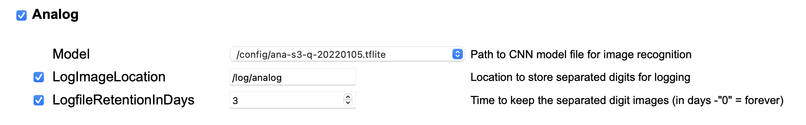
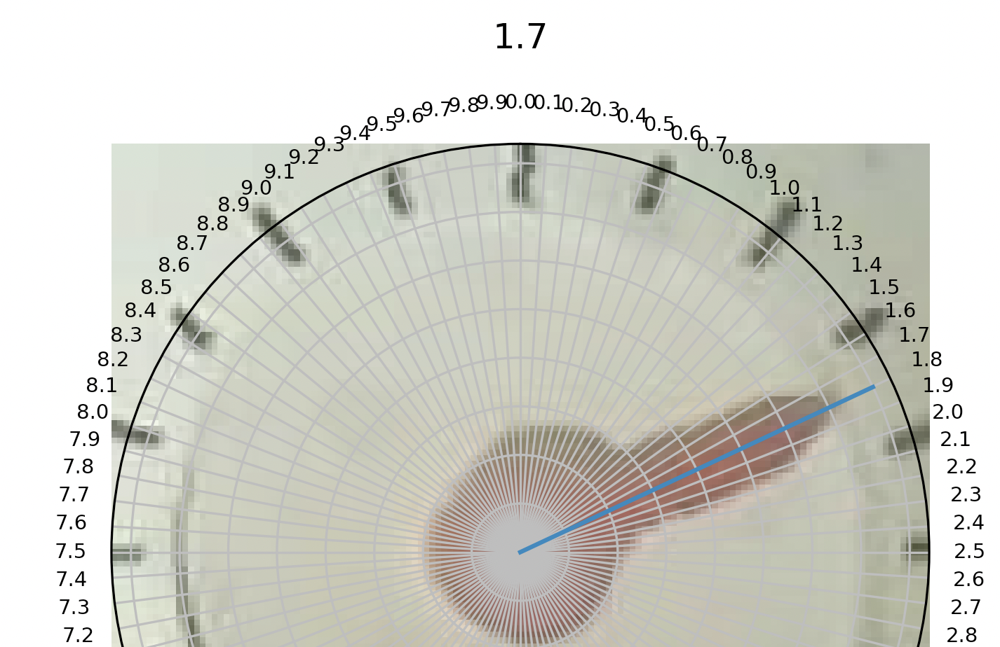
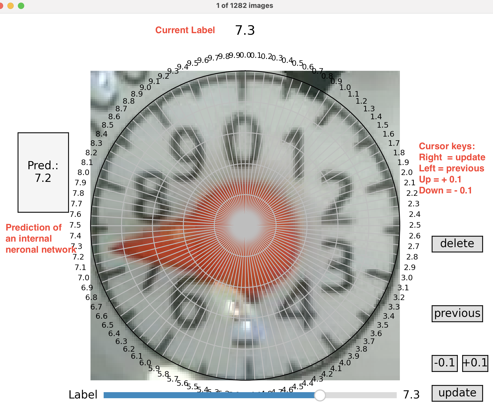

# Readout edge AI pointer from meters

Help us to get more image data and improve your own analog pointer meter predictions!

## Setup your watermeter device

Before you can read the images, you have to configure the logging of the pointers in your device.

Go to you devices and open the configuration.

Now setup the *LogfileRetentionsInDays*. You have to select the checkbox if not already configured.

Please do not change the path of *LogImageLocation* ( /log/analog )

If you had to enable the image logging, you need wait a few days before you can readout all the images.

### Configure ROIs (regions of interest) correctly

Before you read out the images, have a look at

<https://github.com/jomjol/AI-on-the-edge-device/wiki/ROI-Configuration> . It is essential to get good images to learn the neuronal network.

Espessially for analog counter is to center the picture on the pointer.

### Read the images

 
#### Install collectmeteranalog

The [releases](https://github.com/haverland/collectmeteranalog/releases) contains downloads for Windows, Linux and MacOS. But the prefered install is via python's pip.

##### Python

This is mostly the easiest part, if you have installed python on your computer. If not you need to install it ( <https://www.python.org/downloads/> ).

Open a terminal and type in:

    pip install git+https://github.com/haverland/collectmeteranalog

On mac and windows the prediction is not available. It shows everytime a -1. You can manually install it by 

    pip install tensorflow-macos 
or

    pip install tensorflow

The application is called via console

    python3 -m collectmeteranalog --collect=<your-esp32name> --days=3

It downloads now all images in a "data" subfolder. The image names will be hashed for your privacy.
Be patiant. It will takes a while.

After it the duplicates will be automaticly removed and finally you have a folder named data/labled with the images.

##### Windows, MacOS, Linux

The executables are console applications. You must unzip the download and can use it like python from console:

    Windows:    collectmeteranalog.exe --collect=<your-esp32name> --days=3
,

    Linux:      collectmeteranalog --collect=<your-esp32name> --days=3
or

    Macos:      collectmeteranalog --collect=<your-esp32name> --days=3

The startup is on all targets realy slow. 
Windows and MacOS excecutables have no prediction, because the tflite-runtime is only available for linux and 
the complete tensorflow library is to big (600MB) for a single application.
 

### Label the images

Now you can label the images. After reading the images it opens a window.

You can see the counter and have to readjust the label.

There are multiple ways to update the label:
    - Press the `+1.0`, `+0.1`, `-1.0` or `-0.1` buttons on the right lower side.
    - Use the `pageup`, `up`, `pagedown` or `down` keys.  
    - Click onto the pointer on the plot

If you using click option, beware that it set the ticks. But sometimes the ticks are not correct, because the image
is moved or shared.

This pointer is a 1.7. Look at the marks. The 1.5 is under Tick 1.6. So if you click it would label a 1.8. 
We want label like a human would be read the pointer.

If it is correctly, you can click on update. If not use the slider to adjust it.

The prediction on the left side can help you to identify the number. But beware the model can be only a help for you. **Don't trust the recognition!**

After all images are labeled, the window closes automaticly.

### More Options

If the GUI is slow, you can switch off the prediction of the internal neuronal model

    python3 -m collectmeteranalog --collect=<your-esp32name> --days=3 --model=off

Sometimes the Labels on the ticks are to tight. You can change the ticks with

    python3 -m collectmeteranalog --collect=<your-esp32name> --days=3 --ticksteps=2

If you only want label images you can type:

    python3 -m collectmeteranalog --labeling=\<path_to_your_images\>

alternativly a list of files as cvs (index-column is used)

    python3 -m collectmeteranalog --labelfile=\<path_to_your_file\>.csv

or if you want remove similar images. The images must be stored in data/raw_images

    python3 -m collectmeteranalog --collect=<ip or servername> --nodownload

You can keep the downloaded images with option --keepdownloads

    python3 -m collectmeteranalog --collect=<ip or servername> --keepdownloads

If the labeling takes to long, you can later restart at a given number

    python3 -m collectmeteranalog --collect=<ip or servername> --nodownload --startlabel <number>

If another model should be used for prediction (ana-con, ana-class100)

    python3 -m collectmeteranalog --collect=<ip or servername> --model=<modelpath.tflite>

Sometimes it's usefull to change the similiar image recognition. The parameter is default 2. Smaller values for less 
similiars, higher values if you have to much similiars.

    python3 -m collectmeteranalog --collect=<ip or servername> --similiarbits=1

### Ready to share

After labeling you find the images under **"data/labeled"**.

Zip the folder. If it is smaller than 2MB you can mail it to iotson(at)t-online.de. Else please contact us, to find a other way.
